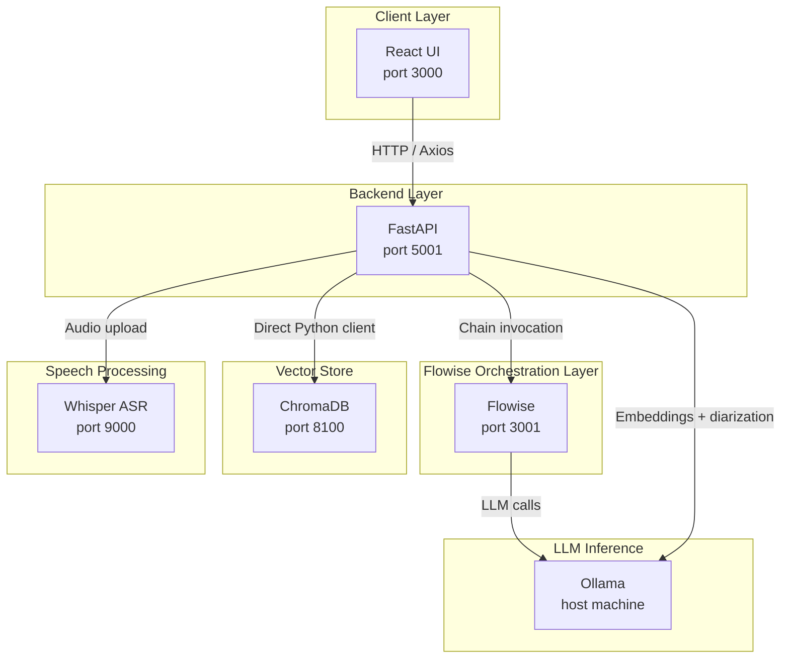

<p align="center">
  
</p>

# MediVault AI — Offline Clinical Intelligence Platform

A fully offline clinical intelligence platform that captures doctor-patient consultations via browser-based audio recording or direct file upload, transcribes speech using a local Whisper ASR container, performs LLM-driven speaker diarization, and generates structured SOAP notes with ICD-10 and CPT billing codes — all without any cloud dependency. Approved notes are embedded into a persistent ChromaDB vector store, enabling retrieval-augmented clinical Q&A and PDF knowledge base ingestion entirely within a local Docker environment.

---

## Table of Contents

- [MediVault AI — Offline Clinical Intelligence Platform](#medivault-ai--offline-clinical-intelligence-platform)
  - [Table of Contents](#table-of-contents)
  - [Project Overview](#project-overview)
  - [How It Works](#how-it-works)
  - [Architecture](#architecture)
    - [Architecture Diagram](#architecture-diagram)
    - [Architecture Components](#architecture-components)
    - [Service Components](#service-components)
    - [Typical Flow](#typical-flow)
  - [Get Started](#get-started)
    - [Prerequisites](#prerequisites)
      - [Verify Installation](#verify-installation)
    - [Quick Start (Docker Deployment)](#quick-start-docker-deployment)
      - [1. Clone the Repository](#1-clone-the-repository)
      - [2. Configure the Environment](#2-configure-the-environment)
      - [3. Build and Start the Application](#3-build-and-start-the-application)
      - [4. Access the Application](#4-access-the-application)
      - [5. Verify Services](#5-verify-services)
      - [6. Stop the Application](#6-stop-the-application)
    - [Local Development Setup](#local-development-setup)
  - [Project Structure](#project-structure)
  - [Usage Guide](#usage-guide)
  - [Inference Metrics](#inference-metrics)
  - [Model Capabilities](#model-capabilities)
    - [Qwen3-4B](#qwen3-4b)
    - [Llama 3.1 8B](#llama-31-8b)
    - [Comparison Summary](#comparison-summary)
  - [Flowise Orchestration](#flowise-orchestration)
  - [Environment Variables](#environment-variables)
    - [Flowise Configuration](#flowise-configuration)
    - [Ollama Configuration](#ollama-configuration)
    - [ChromaDB Configuration](#chromadb-configuration)
    - [Whisper Configuration](#whisper-configuration)
    - [File Upload Limits](#file-upload-limits)
    - [Server Configuration](#server-configuration)
  - [Technology Stack](#technology-stack)
    - [Backend](#backend)
    - [Frontend](#frontend)
    - [Infrastructure](#infrastructure)
  - [Troubleshooting](#troubleshooting)
  - [License](#license)
  - [Disclaimer](#disclaimer)

---

## Project Overview

**MediVault AI** demonstrates how modern open-source AI components can be composed into a clinical documentation workflow that operates entirely on-premises. The platform accepts raw consultation audio, produces a structured SOAP note with billing codes, stores approved notes in a semantic vector database, and exposes a conversational clinical Q&A interface backed by retrieval-augmented generation — all without transmitting any data to external services.

This makes MediVault AI suitable for:

- **Clinical AI research** — reference implementation of a full speech-to-note pipeline
- **Air-gapped environments** — run fully offline with Ollama and locally hosted models
- **Clinical informatics engineering** — integrate Whisper ASR, Ollama inference, Flowise chain orchestration, and ChromaDB vector storage
- **Healthcare AI prototyping** — build and evaluate offline clinical documentation tooling

---

## How It Works

1. The clinician records a consultation in the browser or uploads a WAV or MP3 file.
2. The React frontend sends the audio to the FastAPI backend.
3. The backend forwards the audio to the Whisper ASR container and receives a timestamped transcript.
4. The backend sends the transcript segments to Ollama for LLM-driven speaker diarization — each segment is labelled Doctor or Patient.
5. The diarized transcript is sent to the Flowise SOAP Generator, which invokes an LLMChain with a specialty-aware prompt via Ollama and returns a structured SOAP note.
6. The clinician reviews and edits the SOAP note, then requests ICD-10 and CPT billing codes from the backend.
7. After review, the clinician approves the note — the backend embeds it into ChromaDB using `nomic-embed-text` via the direct Python client.
8. Approved notes and uploaded clinical PDFs are immediately available to the Clinical QA system, which retrieves relevant passages and passes them to Ollama for grounded answers.

All inference runs through Ollama on the host machine. No data leaves the local environment.

---

## Architecture

The application follows a modular five-service architecture. The React frontend communicates exclusively with the FastAPI backend. The backend delegates speech-to-text to the Whisper container, invokes Flowise LLM chains for SOAP generation, writes and queries embeddings directly to ChromaDB, and calls Ollama for diarization, billing codes, and clinical Q&A. Flowise flows are auto-provisioned at startup so the stack is fully operational on the first `docker compose up`.

### Architecture Diagram



### Architecture Components

**Frontend (React + Vite)**

- Consultation Recorder — mode toggle between browser recording and file upload, specialty selector, diarized transcript view with Doctor/Patient colour-coded labels
- SOAP Note Editor — human-in-the-loop review with editable sections, billing code generation, and approve-to-knowledge-base action
- Clinical Chat — conversational Q&A with cited source documents
- Knowledge Base — document list with PDF upload and document deletion
- Nginx serves the production build and proxies all `/api/` requests to the backend

**Backend Services**

- **API Server** (`server.py`): FastAPI application with CORS middleware, request validation, and all route handlers
- **Whisper Client** (`services/whisper_client.py`): Submits audio to the Whisper ASR container and returns timestamped segments
- **LLM Client** (`services/llm_client.py`): Calls Ollama directly for speaker diarization, billing code generation, and clinical Q&A
- **Flowise Client** (`services/flowise_client.py`): Invokes Flowise prediction and upsert endpoints
- **Flowise Provisioner** (`services/flowise_provisioner.py`): Auto-creates the three Flowise flows at API startup if they do not already exist
- **Chroma Client** (`services/chroma_client.py`): Writes and queries the `clinical_kb` ChromaDB collection using the direct Python client
- **PDF Service** (`services/pdf_service.py`): Validates and extracts text from uploaded PDF files

**External Integration**

- **LLM inference**: Ollama running natively on the host machine, accessed from containers via `host.docker.internal:11434`
- **LLM orchestration**: Flowise running as a Docker service, auto-provisioned with three flows at startup
- **Vector store**: ChromaDB running as a Docker service with a persistent named volume

### Service Components

| Service | Container | Host Port | Description |
|---|---|---|---|
| `medivault-api` | `medivault-api` | `5001` | FastAPI backend — transcription, SOAP generation, RAG, billing codes |
| `medivault-ui` | `medivault-ui` | `3000` | React frontend — served by Nginx, proxies `/api/` to the backend |
| `medivault-flowise` | `medivault-flowise` | `3001` | Flowise — LLM chain orchestration, auto-provisioned flows |
| `medivault-chromadb` | `medivault-chromadb` | `8100` | ChromaDB — persistent vector store for clinical knowledge base |
| `medivault-whisper` | `medivault-whisper` | `9000` | Whisper ASR — speech-to-text with timestamped segment output |

> **Ollama is intentionally not a Docker service.** Running Ollama inside Docker bypasses GPU acceleration. Ollama must run natively on the host so the backend and Flowise containers can reach it via `host.docker.internal:11434`.

### Typical Flow

1. Clinician records or uploads consultation audio in the web UI.
2. The backend transcribes the audio via Whisper ASR and receives timestamped segments.
3. The backend calls Ollama to classify each segment as Doctor or Patient.
4. The diarized transcript is sent to the Flowise SOAP Generator — Flowise invokes the LLMChain via Ollama and returns structured SOAP JSON.
5. The clinician reviews the note and requests billing codes — the backend calls Ollama directly for ICD-10 and CPT suggestions.
6. The clinician approves the note — the backend embeds it into ChromaDB via the direct Python client.
7. The clinician asks a clinical question — the backend queries ChromaDB for relevant passages, passes them to Ollama, and returns a grounded answer with cited sources.

---

## Get Started

### Prerequisites

Before you begin, ensure you have the following installed and configured:

- **Docker and Docker Compose** (v2)
  - [Install Docker](https://docs.docker.com/get-docker/)
  - [Install Docker Compose](https://docs.docker.com/compose/install/)
- **Ollama** installed natively on the host machine with the required models:
  - [Install Ollama](https://ollama.com/download)

```bash
ollama pull llama3.1:8b
ollama pull nomic-embed-text
```

#### Verify Installation

```bash
docker --version
docker compose version
docker ps
ollama list
```

### Quick Start (Docker Deployment)

#### 1. Clone the Repository

```bash
git clone https://github.com/cld2labs/MediVaultAI.git
cd MediVaultAI
```

#### 2. Configure the Environment

```bash
cp .env.example .env
```

Open `.env` and confirm the Ollama and service URLs match your environment. See [Environment Variables](#environment-variables) for all available settings.

#### 3. Build and Start the Application

```bash
# Standard (attached)
docker compose up --build

# Detached (background)
docker compose up -d --build
```

#### 4. Access the Application

Once containers are running:

- **Frontend UI**: [http://localhost:3000](http://localhost:3000)
- **Backend API**: [http://localhost:5001](http://localhost:5001)
- **API Docs (Swagger)**: [http://localhost:5001/docs](http://localhost:5001/docs)
- **Flowise Canvas**: [http://localhost:3001](http://localhost:3001)

#### 5. Verify Services

```bash
# Health check
curl http://localhost:5001/health

# View running containers
docker compose ps
```

**View logs:**

```bash
# All services
docker compose logs -f

# Backend only
docker compose logs -f medivault-api

# Flowise only
docker compose logs -f medivault-flowise
```

#### 6. Stop the Application

```bash
docker compose down
```

### Local Development Setup

Run the backend and frontend directly on the host without Docker. Start the required containers first:

```bash
docker compose up medivault-chromadb medivault-whisper medivault-flowise
```

**Backend (Python / FastAPI)**

```bash
cd api
python -m venv .venv
source .venv/bin/activate        # Windows: .venv\Scripts\activate
pip install -r requirements.txt
cp ../.env.example ../.env       # configure CHROMA_HOST=localhost, WHISPER_ENDPOINT=http://localhost:9000
uvicorn server:app --reload --port 5001
```

**Frontend (Node / Vite)**

```bash
cd ui
npm install
npm run dev
```

The Vite dev server proxies `/api/` to `http://localhost:5001`. Open [http://localhost:5173](http://localhost:5173).

---

## Project Structure

```
MediVaultAI/
├── api/                        # FastAPI backend
│   ├── config.py               # All environment-driven settings
│   ├── models.py               # Pydantic request/response schemas
│   ├── server.py               # FastAPI app, routes, and middleware
│   ├── services/
│   │   ├── chroma_client.py    # ChromaDB direct Python client
│   │   ├── flowise_client.py   # Flowise prediction and upsert
│   │   ├── flowise_provisioner.py  # Auto-provision flows at startup
│   │   ├── llm_client.py       # Ollama calls for diarization, billing, QA
│   │   ├── pdf_service.py      # PDF validation and text extraction
│   │   └── whisper_client.py   # Whisper ASR transcription
│   ├── Dockerfile
│   └── requirements.txt
├── ui/                         # React frontend
│   ├── src/
│   │   ├── App.jsx
│   │   ├── components/
│   │   │   ├── ClinicalChat.jsx
│   │   │   ├── ConsultationRecorder.jsx
│   │   │   ├── FlowCanvas.jsx
│   │   │   ├── Header.jsx
│   │   │   ├── KnowledgeBase.jsx
│   │   │   ├── LandingPage.jsx
│   │   │   ├── SoapNoteEditor.jsx
│   │   │   └── StatusBadge.jsx
│   │   └── main.jsx
│   ├── Dockerfile
│   └── nginx.conf
├── docs/
│   └── assets/                 # Documentation images
├── docker-compose.yaml         # Main orchestration file
├── .env.example                # Environment variable reference
├── CONTRIBUTING.md
├── DISCLAIMER.md
├── LICENSE.md
├── README.md
├── SECURITY.md
├── TERMS_AND_CONDITIONS.md
└── TROUBLESHOOTING.md
```

---

## Usage Guide

**Record or upload a consultation:**

1. Open the application at [http://localhost:3000](http://localhost:3000).
2. Click **Launch App** from the landing page.
3. Select a clinical specialty from the dropdown.
4. Click **Record** to capture audio via the browser microphone, or click **Upload** to submit a WAV or MP3 file.
5. Submit the audio to trigger transcription.

**Generate a SOAP note:**

1. After transcription completes, review the diarized transcript — Doctor segments are shown in purple, Patient segments in cyan.
2. Click **Generate SOAP Note**.
3. The SOAP note (Subjective, Objective, Assessment, Plan) appears in the right panel with extracted keywords.
4. Edit any section in the human-in-the-loop editor before proceeding.

**Generate billing codes:**

1. After the SOAP note is displayed, click **Generate Billing Codes**.
2. Review the suggested ICD-10 diagnosis codes and CPT procedure codes.
3. All billing codes require clinician verification before use.

**Approve to knowledge base:**

1. After reviewing the SOAP note and billing codes, enter an optional patient reference.
2. Click **Approve & Save**.
3. The note is embedded into the ChromaDB `clinical_kb` collection and becomes immediately available in Clinical QA.

**Clinical QA:**

1. Open the Clinical Chat panel.
2. Enter any clinical question.
3. The backend retrieves semantically relevant passages from the knowledge base and passes them to Ollama.
4. The answer is displayed with cited source documents.

**Knowledge base management:**

1. Open the Knowledge Base panel.
2. Upload PDF clinical guidelines using the document upload control.
3. Remove any document by ID using the delete control.

---

## Inference Metrics

The table below compares inference performance between different Models on same hardware. The workload covers all three sequential Ollama calls per consultation: diarization, SOAP generation, and billing codes (averaged over 3 runs).

| Provider | Model | Deployment | Context Window | Avg Input Tokens | Avg Output Tokens | Avg Tokens / Request | P50 Latency (ms) | P95 Latency (ms) | Throughput (req/s) | Hardware |
|---|---|---|---|---|---|---|---|---|---|---|
| Ollama | `llama3.1:8b` | Local (CPU) | 128K | 380 | 193.3 | 573.3 | 156,000 | 452,600 | 0.0042 | Intel i7-13700H, 16 GB RAM (CPU-only) |
| Ollama | `qwen3:4b` | Local (CPU) | 128K | 380 | 193.3 | 573.3 | 98,400 | 231,000 | 0.0061 | Intel i7-13700H, 16 GB RAM (CPU-only) |

> **Notes:**
>
> - All metrics use the same MediVault AI workload and identical inputs (3 sequential LLM calls per consultation: diarization, SOAP generation, billing codes). Token counts may vary slightly per run due to non-deterministic model output.
> - Ollama runs CPU-only (Intel i7-13700H, no discrete GPU), running Ollama on a GPU-equipped machine would reduce per-call latency by 5–10x.

---

## Model Capabilities

### Qwen3-4B

A 4-billion-parameter open-weight model from Alibaba's Qwen team, well-suited for structured output generation and clinical text tasks at low hardware cost.

| Attribute | Details |
|---|---|
| **Parameters** | 4.0B total |
| **Architecture** | Transformer with Grouped Query Attention (GQA) |
| **Context Window** | 128,000 tokens |
| **Structured Output** | JSON-structured responses supported |
| **Quantization Formats** | GGUF (Q4_K_M ~2.5 GB, Q8_0 ~4.3 GB) |
| **Inference Runtimes** | Ollama, llama.cpp, LMStudio |
| **License** | Apache 2.0 |
| **Deployment** | Local, on-prem, air-gapped — full data sovereignty |
| **tok/s on i7-13700H** | ~15–17 tok/s (CPU, Q4_K_M) |

### Llama 3.1 8B

An 8-billion-parameter open-weight model from Meta, strong on instruction following, clinical question answering, and SOAP generation quality.

| Attribute | Details |
|---|---|
| **Parameters** | 8.0B total |
| **Architecture** | Transformer with Grouped Query Attention (GQA) |
| **Context Window** | 128,000 tokens |
| **Structured Output** | JSON-structured responses supported |
| **Quantization Formats** | GGUF (Q4_K_M ~4.9 GB, Q8_0 ~8.5 GB) |
| **Inference Runtimes** | Ollama, llama.cpp, vLLM, LMStudio |
| **License** | Llama 3.1 Community License |
| **Deployment** | Local, on-prem, air-gapped — full data sovereignty |
| **tok/s on i7-13700H** | ~9–10 tok/s (CPU, Q4_K_M) |

### Comparison Summary

| Capability | Qwen3-4B | Llama 3.1 8B |
|---|---|---|
| SOAP note generation | Yes | Yes |
| Billing code extraction (ICD-10 / CPT) | Yes | Yes |
| Speaker diarization classification | Yes | Yes |
| Clinical QA with RAG | Yes | Yes |
| On-prem / air-gapped deployment | Yes | Yes |
| Data sovereignty | Full (weights run locally) | Full (weights run locally) |
| Open weights | Yes (Apache 2.0) | Yes (Community License) |
| Context window | 128K | 128K |
| RAM required (Q4_K_M) | ~4 GB | ~6 GB |
| Speed on CPU (i7-13700H) | ~15–17 tok/s | ~9–10 tok/s |
| Output quality | Good — fast iteration | Better — recommended for production |

> `qwen3:4b` is recommended when response speed is the priority or RAM is constrained. `llama3.1:8b` produces higher-quality SOAP notes and more accurate billing code suggestions and is the default model for this stack.

---

## Flowise Orchestration

Three Flowise flows are automatically provisioned when the stack starts. No manual flow configuration is required.

### MediVault SOAP Generator

An `LLMChain` composed of a `ChatPromptTemplate` and a `ChatOllama` node. The prompt is specialty-aware and instructs the model to produce a structured SOAP note from diarized consultation transcript segments.

### MediVault Clinical QA

A `ConversationalRetrievalQAChain` composed of a `ChromaDB` retriever, a `BufferMemory` node for conversation history, and a `ChatOllama` node. The chain returns answers with `returnSourceDocuments: true`.

### MediVault KB Upsert

A flow combining `PlainText` input, `OllamaEmbeddings`, and a `ChromaDB` sink for document ingestion operations.

Inspect all live flow topologies by opening the Flowise canvas at [http://localhost:3001](http://localhost:3001).

---

## Environment Variables

All variables are defined in `.env` (copied from `.env.example`). The backend reads them at startup via `python-dotenv`.

### Flowise Configuration

| Variable | Description | Default |
|---|---|---|
| `FLOWISE_ENDPOINT` | Internal URL of the Flowise service | `http://medivault-flowise:3001` |
| `FLOWISE_API_KEY` | Flowise API key for authenticated requests | _(empty — auth disabled)_ |

### Ollama Configuration

| Variable | Description | Default |
|---|---|---|
| `OLLAMA_BASE_URL` | URL of the Ollama service on the host | `http://host.docker.internal:11434` |
| `OLLAMA_MODEL` | Ollama model used for LLM inference | `llama3.1:8b` |
| `OLLAMA_EMBED_MODEL` | Ollama model used for embeddings | `nomic-embed-text` |

### ChromaDB Configuration

| Variable | Description | Default |
|---|---|---|
| `CHROMA_HOST` | ChromaDB service hostname | `medivault-chromadb` |
| `CHROMA_PORT` | ChromaDB internal port | `8000` |

### Whisper Configuration

| Variable | Description | Default |
|---|---|---|
| `WHISPER_ENDPOINT` | Internal URL of the Whisper ASR service | `http://medivault-whisper:9000` |
| `WHISPER_MODEL` | Whisper model size | `small` |

### File Upload Limits

| Variable | Description | Default |
|---|---|---|
| `MAX_AUDIO_SIZE` | Maximum accepted audio file size in bytes | `26214400` (25 MB) |
| `MAX_FILE_SIZE` | Maximum accepted document file size in bytes | `10485760` (10 MB) |

### Server Configuration

| Variable | Description | Default |
|---|---|---|
| `BACKEND_PORT` | Port the FastAPI server listens on | `5001` |

---

## Technology Stack

### Backend

- **Framework**: FastAPI (Python 3.11+) with Uvicorn ASGI server
- **LLM Orchestration**: Flowise — auto-provisioned chains for SOAP generation
- **LLM Inference**: Ollama — runs natively on host for diarization, billing codes, and clinical QA
- **Vector DB Client**: chromadb-client — direct Python client for all upsert and query operations
- **PDF Processing**: pypdf for text extraction from uploaded PDF files
- **Config Management**: python-dotenv for environment variable injection at startup
- **Data Validation**: Pydantic v2 for request/response schema enforcement

### Frontend

- **Framework**: React 18 with Vite (fast HMR and production bundler)
- **Styling**: Tailwind CSS with dark mode
- **Icons**: Lucide React
- **HTTP Client**: Axios
- **Flow Visualisation**: @xyflow/react
- **Production Server**: Nginx — serves the built assets and proxies `/api/` to the backend container

### Infrastructure

| Component | Technology |
|---|---|
| Containerisation | Docker Compose (5 services) |
| LLM inference | Ollama (host machine) |
| LLM orchestration | Flowise |
| Speech-to-text | Whisper ASR (onerahmet/openai-whisper-asr-webservice, faster_whisper engine) |
| Vector store | ChromaDB (containerised, persistent named volume) |

---

## Troubleshooting

For common issues and solutions, see [TROUBLESHOOTING.md](./TROUBLESHOOTING.md).

Quick diagnostic commands:

```bash
# Health check
curl http://localhost:5001/health

# View logs for all services
docker compose logs -f

# View logs for a specific service
docker compose logs -f medivault-api

# Check container health status
docker compose ps

# Restart a single service
docker compose restart medivault-flowise

# Rebuild and restart the entire stack
docker compose down && docker compose up --build
```

---

## License

This project is licensed under the MIT License. See [LICENSE.md](./LICENSE.md) for details.

---

## Disclaimer

**MediVault AI** is provided as-is for demonstration and educational purposes. While we strive for accuracy:

- All AI-generated SOAP notes, ICD-10 codes, CPT codes, and clinical Q&A responses must be reviewed and approved by a licensed clinician before use in any clinical context
- Do not rely solely on AI-generated outputs without independent clinical verification
- Do not use this system with real patient data without implementing full HIPAA, GDPR, and applicable regulatory compliance measures
- The quality of outputs depends on the underlying Ollama model and the content of the ingested knowledge base

For full disclaimer details, see [DISCLAIMER.md](./DISCLAIMER.md).
